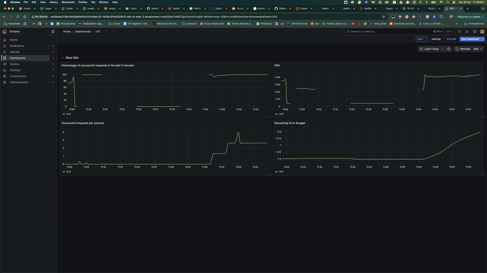
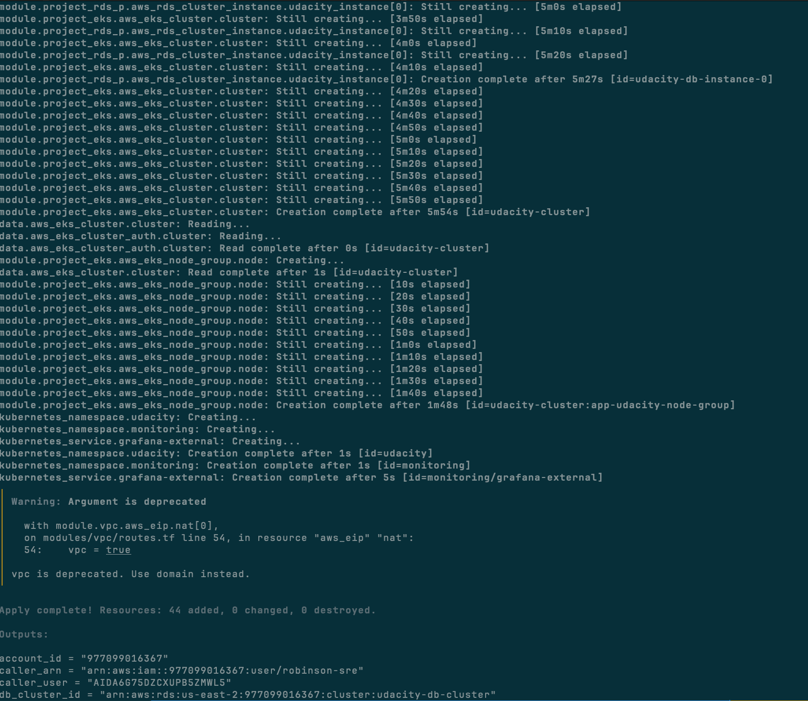
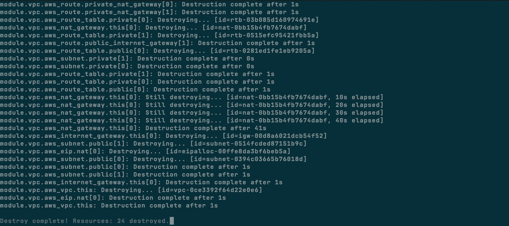
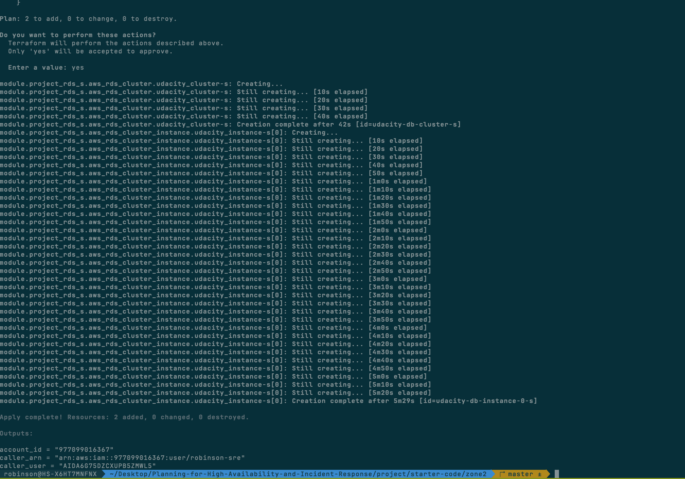

> Students must create a Grafana dashboard with 4 panels, each showing a key metric related to the provided SLO/SLI objectives

> A screenshot of the successful Terraform run that deploys the infrastructure.

> One showing the successful Terraform destroy command for zone1.

> The RDS instance in zone2 must be configured as a replica of the RDS instance in zone1. This must be defined in the Terraform code.

